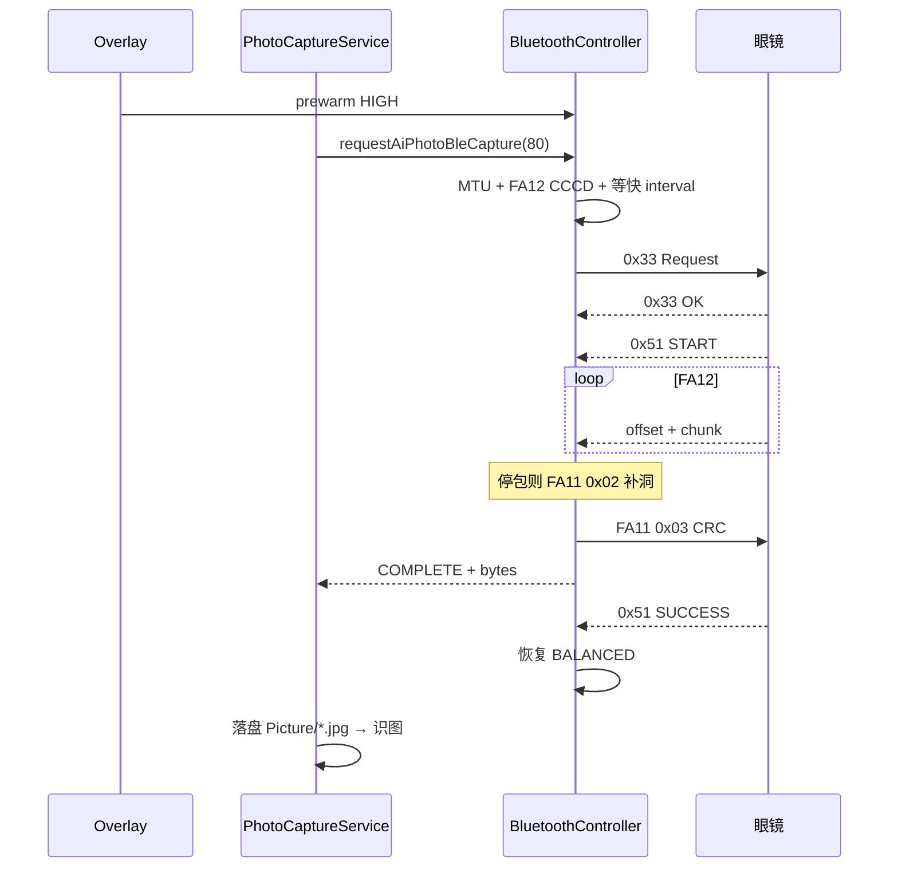
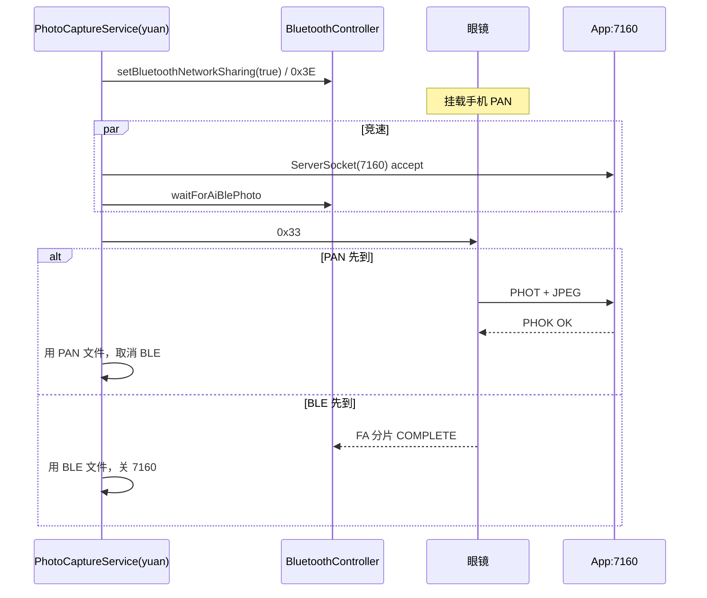

# AI 拍照识图传图 — App 端接收处理说明

> 对应需求：《AI 拍照识图传图提速 — App 端连接参数配合需求》  
> 文档重点：**App 如何接收眼镜回传的 JPEG**（含 BLE 与蓝牙共享网络两种模式）  
> 对照源码：`app/` 现行包 · `glass_test/yuan/` 历史双模实现  
> 更新日期：2026-09-15  

---

## 0. 结论先看

| 模式 | 通道 | 现行「拍照识物」 | 说明 |
|---|---|---|---|
| **模式 A** | BLE FA10（`0x33` + FA12） | **唯一路径** | 不依赖系统「蓝牙网络共享」 |
| **模式 B** | 蓝牙共享网络（`0x3E` PAN TCP:7160 / 旧 FTP） | **识物已停用** | 历史识物双模；现行仅普通拍照等残留 |

现行证据：`PhotoCaptureService.captureAndRecognize()` 固定日志 `传图模式=BLE FA10`，只调 `waitForBleAiPhotoReturn()`；AI 会话下收到 `0x51 FTP_READY(0x04)` 直接忽略。

---

## 1. 入口与职责切分

```text
首页「拍照识物」
  → MainActivity.startPhotoIdentifyCapture()
  → Overlay + prewarm HIGH
  → PhotoCaptureService.captureAndRecognize()
       ├─【现行】waitForBleAiPhotoReturn()     ← 模式 A
       └─【历史 yuan】waitForPanAiPhotoReturn() ← 模式 B ∥ BLE 竞速
  → GlassesAiRepository.recognizeImage()
  → Overlay + 可选 TTS
```

| 层 | 类 | 职责 |
|---|---|---|
| UI 编排 | `MainActivity` | 门禁、Overlay、预热 HIGH、启动会话 |
| 业务状态机 | `PhotoCaptureService` | 发令、等图、落盘、识图、播报 |
| 链路 | `BluetoothController`（`BluetoothManager.kt`） | 0x33/0x51、FA10 收块、CRC、优先级、0x3E |
| 视觉 | `GlassesAiRepository` | 压缩图 + chat/completions |

---

## 2. 模式 A：BLE FA10 传图（现行识物）

### 2.1 选用条件

- 用户走「拍照识物」→ `captureAndRecognize`
- **无运行时二选一**：不看有无内存、不开 PAN、不竞速 FTP/SPP

### 2.2 App 接收处理总览

```text
prewarm HIGH
  → 确保 MTU≥247 + FA12 CCCD
  → （尽量）等连接 interval 进入快档
  → 写 0x33（quality=80）
  → 收 0x51 START → 开接收缓冲
  → 循环收 FA12（offset + JPEG chunk）
  → 收齐算 CRC32 → 写 FA11 0x03
  → 本地先 COMPLETE 落盘（不等 SUCCESS 再出图）
  → 0x51 SUCCESS 确认固件侧
  → 恢复 BALANCED
  → 业务层拿 File 去识图
```

### 2.3 分步说明（App 侧）

#### Step 1 — 会话预热（收图前）

| 动作 | 实现 | 目的 |
|---|---|---|
| Overlay 打开即升 HIGH | `prewarmAiPhotoBlePriority("overlay_open")` | 给系统几百 ms 改连接间隔 |
| `capture_start` 再升一次 | `prewarmAiPhotoBlePriority("capture_start")` | 与发令对齐 |
| 清空旧媒体事件 | `resetMediaSyncData` / `clearLatestPhotoReadyEvent` | 避免误用上一张图 |

#### Step 2 — 通道就绪

`BluetoothController.requestAiPhotoBleCapture(80)` 内部：

1. ATT MTU：目标 **517**，下限 **≥247**，不够则取消本轮传图；
2. 确认 FA10 服务、FA11 Write、FA12 Notify + CCCD 已开；
3. 通道就绪超时约 **8s**；
4. 发 0x33 前可再等约 **800ms**，希望 `interval ≤ 16`（≈20ms；理想 6~12）。

#### Step 3 — 拍照命令

- 帧：FFF0 `55 AA` 管理通道，命令 **`0x33`**，payload = JPEG quality（固定 **80**）
- 眼镜 Response：`err=0` 接受；非 0 拒绝（低电/忙等），可 **400ms 后再发 1 次**
- **不再**调用 `setBluetoothNetworkSharing(true)`（`0x3E`）

#### Step 4 — 开收

收到 **`0x51` status=`0x01` START**（可带 `file_size` u32 LE）：

- `beginAiPhotoReceive(fileSize)`：分配 buffer + BitSet 记洞；
- 启动停包 watchdog；
- START 之前冲进来的 FA12 进 `aiPhotoEarlyChunks`，START 后回填。

#### Step 5 — 收块（核心）

| 项 | 行为 |
|---|---|
| 特征 | FA12 Notify，裸包（非 55 AA） |
| 格式 | `offset u32 LE` + JPEG 数据 |
| 组包 | 按 offset 写入 buffer，BitSet 标记已收块 |
| 首块兜底 | 若连接 interval 仍偏慢（约 40ms），`maybeRetryAiPhotoHighOnFirstChunk()` 再调一次 HIGH |
| 首轮连发 | **禁止**立刻写 FA11 `0x02`，避免 Write 饿死 Notify |

#### Step 6 — 停包补洞

| 参数 | 典型值 |
|---|---|
| 停包判定 | ~3.5s 无新包 |
| 补洞 | FA11 Write `0x02 \| offset u32 LE` |
| 单轮等待 | ~2.5s |
| 最大轮次 | ≤24（长时间 0 包可提前结束） |

#### Step 7 — 收齐确认

1. App 本地算整图 **CRC32**；
2. 写 FA11：`0x03 \| crc32 u32 LE`；
3. **本地先** `emitAiPhotoComplete` → 业务落盘（避免等 SUCCESS 卡 UI）；
4. 眼镜回 `0x51 SUCCESS(0x02)` 或 `FAILED(0x03)`；
5. 会话结束：`CONNECTION_PRIORITY_BALANCED`。

#### Step 8 — 业务落盘与识图

1. `waitForAiBlePhoto` 订阅 `aiPhotoBleEvents` / terminal：`COMPLETE` / `FAILED`；
2. 写文件：`{filesDir}/Picture/<name或ai_ble_*.jpg>`；
3. `GlassesAiRepository.recognizeImage`（边长约 640 / Q≈55）；
4. 历史拷贝：`filesDir/photo-identify-history/`。

### 2.4 成功 / 失败 / 取消（App 怎么回）

| 场景 | App 行为 |
|---|---|
| 成功 | FA11 `0x03` + 本地 COMPLETE → `PhotoCaptureState.Success` |
| 眼镜失败 | `0x51 FAILED` → `emitAiPhotoFailed` → Overlay Error |
| App 超时 | 业务约 **30s**；底层约 **25s + 有进度宽限 15s** → 写 FA11 **`0x04` 取消** |
| 用户关 Overlay | `cancelAiPhotoBleTransfer` → FA11 `0x04` |
| 优先级 | 完成 / 失败 / 取消后均恢复 **BALANCED** |

### 2.5 模式 A 时序图



---

## 3. 模式 B：蓝牙共享网络传图（历史识物 / 现行残留）

### 3.1 是什么

「蓝牙共享网络传图」指：手机打开系统 **蓝牙网络共享（PAN）**，眼镜挂载手机网，再经 **TCP** 或 **FTP** 把 JPEG 推到 App。

| 子路径 | 端口 / 协议 | 识物现状 |
|---|---|---|
| **PAN TCP** | App 监听 **7160**，眼镜主动连入推图 | 历史识物主路径（有内存）；现行识物 **已移除** |
| **FTP** | 眼镜报 IP，App 当 FTP 客户端拉图 | 旧 FTP_READY (`STATUS_LEGACY_FTP_READY=0x04` 状态码而非 0x33 命令)；现行识物 **忽略**；**普通拍照** `captureOnly` 仍用 |
| **SPP/GFSP** | 经典蓝牙 RFCOMM（非共享网络） | 无内存机历史竞速 / 现行 `captureOnly` |

### 3.2 历史识物（yuan）App 如何处理

有内存设备：`waitForPanAiPhotoReturn()`

1. **确保共享网络**：`setBluetoothNetworkSharing(true)` → BLE 下发 **`0x3E`**；
2. **并行竞速**（约 8s）：
   - Job A：`waitForPanPhotoViaTcp(7160)`
   - Job B：`waitForAiBlePhoto`（当时的 BLE 分片）
3. 发 **`0x33`**（可不再强制重复开共享）；
4. **谁先完整到图用谁**，取消另一路；
5. 两路都失败 → 提示用户开启系统「蓝牙网络共享」。

无内存设备：`waitForMemorylessAiPhotoReturn()` — **SPP ∥ BLE** 竞速（同样不依赖 PAN）。

#### PAN TCP 接收格式（App 侧）

| 段 | 内容 |
|---|---|
| Header 40B | `"PHOT"`(4) + `total_size` u32 LE(4) + `file_name[32]` 零填充 |
| Body | JPEG `total_size` 字节 |
| ACK | `"PHOK"`(4) + `status`(1)：`0x00` 成功 / 非 0 失败 |

落盘：`{filesDir}/Picture/<file_name>`。

### 3.3 现行包中与「共享网络」相关的残留

#### A. 识物路径 — 明确不做

- `captureAndRecognize` **不**开 `0x3E`、**不**起 `ServerSocket(7160)`、**不** FTP 拉图；
- AI_BLE 会话收到 `0x51 status=0x04 FTP_READY` → 日志「忽略遗留 FTP_READY」；
- AI 实时对话也不再为识图开共享网络。

#### B. 普通拍照 `captureOnly` — 仍可能走 FTP / SPP

```text
有内存：
  0x30 普通拍照 → 0x51 FTP_READY(+IP) → downloadPhotoFromFtp → Picture/

无内存：
  经典蓝牙 SPP GFSP 分片 → Picture/spp_*.jpg
```

FTP 处理要点（App）：

1. 等 `PhotoReadyEvent.isFtpReady`；可选 `requestFtpIp()` 兜底；
2. 客户端连眼镜 FTP（常见凭据尝试：`bk7258/123456`、`admin/admin`、anonymous）；
3. 目录优先 `/sd0`、`/`，取最新照片 `retrieveFile`；
4. 超时参考：connect ~6s，soTimeout ~8s，等 PHOTO_READY ~30s。

#### C. `0x3E` 仍存在的用途

- OTA、设置页手动「开蓝牙共享网络」；
- **不是**拍照识物触发条件。

### 3.4 模式 B（历史识物）时序图



---

## 4. 两种模式对比（接收视角）

| 维度 | 模式 A · BLE FA10 | 模式 B · 蓝牙共享网络 |
|---|---|---|
| 现行识物 | ✅ 唯一 | ❌ 已移除 |
| 前置依赖 | BLE 已连 + MTU/CCCD | 系统蓝牙网络共享 + `0x3E` |
| 触发拍照 | `0x33` | 历史同样 `0x33`（可兼开共享） |
| 数据面 | FA12 Notify 分块 | TCP:7160 整图 或 FTP 拉文件 |
| App 角色 | GATT 收 Notify + FA11 控 | TCP Server 或 FTP Client |
| 完整性 | BitSet 补洞 + CRC32 | TCP 读满 length / FTP 文件长度 |
| 成功回执 | FA11 `0x03` + 等 `0x51 SUCCESS` | PAN：`PHOK`；FTP：本地文件 OK |
| 取消 | FA11 `0x04` | 关 Socket / 停下载（历史） |
| 连接参数 | 会话 HIGH → 结束 BALANCED | 依赖 PAN 链路质量，无 FA10 HIGH 策略 |
| 典型耗时 | ~1.4s（HIGH+固件 10ms）/ ~3.6s（40ms） | 受 DHCP/路由/FTP 影响，失败时空等更长 |
| 失败提示 | 传图超时 / 眼镜失败 | 历史文案强调「请开启蓝牙网络共享」 |

---

## 5. `captureAndRecognize` vs `captureOnly`

| | 拍照识物 `captureAndRecognize` | 仅拍照 `captureOnly` |
|---|---|---|
| 命令 | **0x33** | **0x30** |
| 传图 | **仅模式 A（BLE FA10）** | 有内存 **FTP**；无内存 **SPP** |
| 是否开共享网络 | 否 | 否（FTP 走眼镜侧网络栈，不经识物 0x3E） |
| AI / TTS | 有 | 无 |
| 取消 | FA11 `0x04` | 无 FA10 会话 |

---

## 6. 关键参数速查（模式 A）

| 参数 | 值 |
|---|---|
| JPEG quality（0x33） | 80 |
| MTU 下限 / 目标 | 247 / 517 |
| 通道就绪 | ~8s |
| interval 等待 | ~800ms |
| App 等终态 | ~30s（业务） |
| 底层超时 | ~25s + 进度宽限 ~15s |
| 停包 / 补洞 | 3.5s / 2.5s×≤24 |
| HIGH 时机 | Overlay 打开、capture_start、0x33、首块仍慢可补一次 |
| 落盘 | `filesDir/Picture/` |

---

## 7. 代码索引

| 文件 | 符号 | 模式 |
|---|---|---|
| `app/.../service/PhotoCaptureService.kt` | `captureAndRecognize`, `waitForBleAiPhotoReturn`, `waitForAiBlePhoto` | A 现行 |
| 同上 | `captureOnly`, `downloadPhotoFromFtp`, `waitForSppPhotoViaClassic` | B 残留（非识物） |
| `app/.../bluetooth/BluetoothManager.kt` | `requestAiPhotoBleCapture`, `handleAiPhotoFa12Packet`, `beginAiPhotoReceive`, `maybeFinishOrRetransmitAiPhoto`, `writePhotoCtrl`, `prewarmAiPhotoBlePriority`, `cancelAiPhotoBleTransfer` | A |
| 同上 | `setBluetoothNetworkSharing`（0x3E） | B / OTA / 设置 |
| `app/.../MainActivity.kt` | `startPhotoIdentifyCapture` | A 入口 |
| `glass_test/yuan/.../PhotoCaptureService.kt` | `waitForPanAiPhotoReturn`, `waitForPanPhotoViaTcp`, `ensureBluetoothNetworkSharingForPhoto` | B 历史识物 |

---

## 8. 联调注意

1. 验现行识物时，**不要**再以「是否开蓝牙网络共享」作为成功条件；应看 FA12 进度与 `onConnectionUpdated` interval。  
2. 若日志仍出现 `FTP_READY` 而被忽略，说明固件还带旧状态，App 侧属预期行为。  
3. 提速必须以 **模式 A + HIGH + 固件块间隔 ~10ms** 配套；模式 B 不在本提速方案内。  
4. 对比历史行为请查 `glass_test/yuan`，不要与现行 `app/` 混用结论。  

---

*本文专述 App 端「如何接收」；连接优先级与耗时目标详见同系列《AI识图传图提速_App连接参数配合》。*
