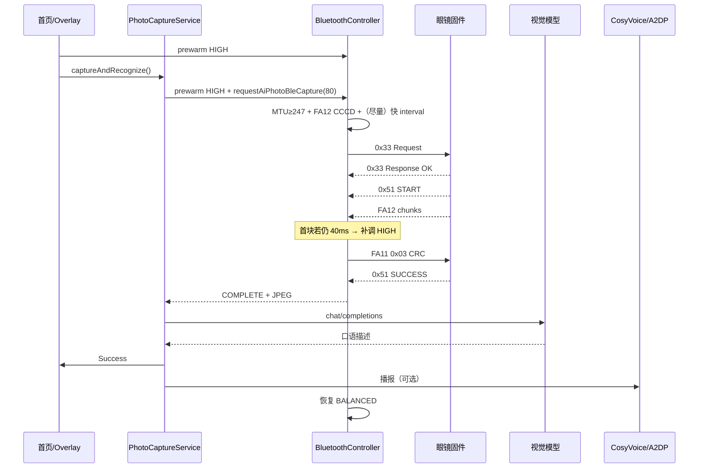

# AI 拍照识图传图提速 & App 端识图全流程说明

> 需求方：眼镜固件侧（Glass-D15 V2.4.5）  
> 文档整合日期：2026-09-14  
> 适用范围：glassfront App（对照源码 v3.0.x）  
> 原始需求日期：2026-09-05  

---

## 目录

1. [背景与目标](#一背景与目标)
2. [传图通道与性能基线](#二传图通道与性能基线)
3. [App 连接优先级配合需求（固件侧）](#三app-连接优先级配合需求固件侧)
4. [预期效果与验证方法](#四预期效果与验证方法)
5. [App 端拍照识图完整流程](#五app-端拍照识图完整流程)
6. [BLE / FA10 协议细节](#六ble--fa10-协议细节)
7. [传图模式对比](#七传图模式对比)
8. [视觉模型与 TTS](#八视觉模型与-tts)
9. [速度相关参数一览](#九速度相关参数一览)
10. [App 落地现状（源码对照）](#十app-落地现状源码对照)
11. [关键类与文件索引](#十一关键类与文件索引)
12. [注意事项与配套发布](#十二注意事项与配套发布)

---

## 一、背景与目标

### 1.1 业务场景

用户在 App「眼镜首页」点击 **拍照识物** 后：

1. App 通过 BLE 下发拍照命令；
2. 眼镜拍照，经 **BLE FA10** 通道把 JPEG 回传到手机；
3. App 调用视觉大模型识别；
4. 结果展示在 Overlay，并可 CosyVoice / A2DP 播报。

**当前瓶颈主要在「传图」阶段**（约 3.6s），不是拍照本身（约 1.4s）或识图 HTTP。

### 1.2 目标

在识图会话期间，App 将 BLE **连接优先级调到 HIGH**，使连接间隔从约 **40ms** 降到 **7.5~15ms**；固件同步把块间发送节奏从 40ms 调到约 10ms，传图耗时目标从 **~3.6s → ~1.4s**（约 2.5 倍）。

---

## 二、传图通道与性能基线

### 2.1 通道概况

| 项 | 值 |
|---|---|
| 服务 | `0xFA10` |
| 数据通知 | `0xFA12`（收图） |
| 控制写 | `0xFA11`（op2 补发 / op3 CRC / op4 取消） |
| MTU | 协商目标 517；下限要求 ≥247 |
| 典型图大小 | ~18KB |
| 典型块大小 | 240B / 块 |
| 块数估算 | 18KB ÷ 240B ≈ **77 块** |

### 2.2 固件侧实测（2026-09-05）

| 项 | 当前值 |
|---|---|
| 手机批准的实际连接间隔 | **intv=32（40ms）** |
| 设备发送节奏 | 40ms/块（按 40ms 间隔 1:1 排水） |
| 传图耗时 | 77 × 40ms ≈ 3.1s + 手机 CRC ~0.6s ≈ **3.6s** |
| 丢块 | 0（40ms 节奏下零补发） |

固件在传图开始时会发起 LL 连接参数更新（请求 min 7.5ms / max 15ms），但 Android 常按 **BALANCED** 策略回 **intv=32**，导致 turbo **未生效**。

### 2.3 其它节奏试验（供参考）

| 节奏 | 结果 |
|---|---|
| **8ms** | L2CAP 池打满后 ATT 静默丢包，丢块 ~35%，靠 op2 补发，总耗时 ~18s（不可用） |
| **40ms** | 零丢块、零补发，3.6s（当前线上） |
| **10ms + HIGH** | 预期 1.4s（本需求目标） |

---

## 三、App 连接优先级配合需求（固件侧）

### 3.1 会话开始升 HIGH

在发送 **0x33 识图拍照命令之后立即调用**（也可在 Overlay 打开 / 发令前预热）。拍照前置约 1.4s，足够参数在传图前生效：

```java
// 发送 0x33 识图拍照命令之后立即调用
if (gatt != null) {
    boolean ok = gatt.requestConnectionPriority(BluetoothGatt.CONNECTION_PRIORITY_HIGH);
    if (!ok) {
        // 通常因未连接/请求进行中，可延时 200ms 重试一次；
        // 仍失败不影响功能（退化为现状速度）
    }
}
```

### 3.2 传图结束恢复 BALANCED

```java
// 传图完成（回 op3 CRC）或失败（op4 取消 / 超时）后
if (gatt != null) {
    gatt.requestConnectionPriority(BluetoothGatt.CONNECTION_PRIORITY_BALANCED);
}
```

恢复时机建议：

- 收到传图结果通知（`0x51` SUCCESS/FAILED）后；或
- App 识图会话统一收尾点（`resetToIdle` / 取消 / 超时）；
- **失败路径也要恢复**。

### 3.3 调用原则

1. `requestConnectionPriority` 是**异步**的；可用 `onConnectionUpdated`（API 26+）观察 interval。
2. 部分 ROM 对 HIGH 有频控——**每个会话开始/结束各调一次即可**，不要反复刷。
3. 传图期间若并发 A2DP 等，系统可能自行调回 BALANCED。兜底：收到**第一块 FA12** 时若仍是 40ms，可再补调一次 HIGH。
4. 调用失败（返回 false）不影响功能，仅速度维持 ~3.6s。

---

## 四、预期效果与验证方法

### 4.1 预期

| 阶段 | 当前 | 目标 |
|---|---|---|
| 连接间隔 | 40ms (intv=32) | 7.5~15ms (intv=6~12) |
| 设备块间延时 | 40ms | ~10ms（固件宏，需配套发版） |
| 传图 | ~3.6s | ~1.4s |
| 丢块 | 0 | 仍为 0 |

> **单独改 App 或单独改固件都不生效**，必须配套发布。

### 4.2 验证

**手机侧**

- `onConnectionUpdated` 打印 interval；传图期间应为 **6~12**（7.5~15ms），而不是 32。

**设备侧日志**

- 传图开始后：`BK_BLE_GAP_UPDATE_CONN_PARAMS_EVT status=0 intv=6`（或 8/12）；
- 此前常见：`intv=32`。

**耗时**

- 从 `AI_PHOTO_START_RX` 到 `AI_PHOTO_COMPLETE`：~3.6s → ~1.4s；
- 无大量 `AI_PHOTO_STALL_RETRY`。

---

## 五、App 端拍照识图完整流程

### 5.1 一句话

**首页「拍照识物」→ `PhotoCaptureService` → BLE `0x33` + FA10 收 JPEG → `GlassesAiRepository` 视觉模型 → Overlay 展示 + CosyVoice/A2DP TTS。**

> AI 实时对话内的「拍照识图」口令已禁用，会提示用户去首页使用「拍照识物」。

### 5.2 入口与门禁

| 入口 | 说明 |
|---|---|
| 眼镜首页 `GlassesHomeScreen` | 「拍照识物」ToolItem：点击启动；长按：TTS 开关 / 历史 |
| `MainActivity.startPhotoIdentifyCapture` | 组装 Service、Overlay、门禁、预热 HIGH |
| Overlay `PhotoIdentifyOverlay` | 进度、原图、结果、圈选再识、下载、重播、历史 |

**门禁条件（拦截则不发 0x33）**：

- 媒体同步中 / BLE 未连接 / 命令通道未就绪；
- 正在录像/录音（可先停冲突录制）；
- AI 实时对话进行中；
- 上一轮识图仍在进行（busy）。

**启动序列**：

1. `photoCaptureService.resetToIdle()`
2. 显示 Overlay
3. `bluetoothController.prewarmAiPhotoBlePriority("overlay_open")` ← **提前升 HIGH**
4. 停冲突录制
5. `captureAndRecognize(enableTts = PhotoIdentifyStore.isTtsEnabled())`

### 5.3 状态机

```
Idle
 → SendingCommand      // 发 0x33
 → WaitingForPhoto     // 等拍照 + FA10 收图
 → DownloadingPhoto    //（BLE 路径上与 Waiting 合并感知；落盘完成）
 → RecognizingImage    // 视觉模型
 → SynthesizingTts     // 可选
 → Success / Error
```

对应实现：`PhotoCaptureService` / `PhotoCaptureState`。

### 5.4 端到端时序

```text
用户点击「拍照识物」
        │
        ├─ Overlay 打开
        ├─ prewarm HIGH（连接优先级）
        │
        ▼
PhotoCaptureService.captureAndRecognize()
        │
        ├─ prewarmAiPhotoBlePriority("capture_start")
        ├─ 等待 BLE AI 回图 waitForBleAiPhotoReturn()
        │       │
        │       ├─ 确保 MTU≥247、FA12 CCCD 就绪
        │       ├─ （可选）等待 interval 进入快档
        │       ├─ 发送 0x33 + quality(80)
        │       ├─ 眼镜 0x33 Response err=0
        │       ├─ 0x51 START(+可选 file_size)
        │       ├─ FA12 分块 Notify（首块时可补调 HIGH）
        │       ├─ 停包则 FA11 op2 补洞
        │       ├─ 收齐后 FA11 op3 + CRC32
        │       └─ 0x51 SUCCESS → COMPLETE + JPEG 文件
        │
        ├─ GlassesAiRepository.recognizeImage()
        │       ├─ 压缩：最长边 640 / JPEG Q≈55
        │       └─ OpenAI 兼容 chat/completions（非流式）
        │
        ├─ Overlay 展示 Success + 写入历史
        └─ CosyVoice / 后端 TTS → A2DP 或本机扬声器播报
                │
                └─ 会话结束：恢复 CONNECTION_PRIORITY_BALANCED
```

### 5.5 Overlay 额外能力

| 能力 | 说明 |
|---|---|
| 圈选再识 | `recognizeImageRegion()`：不重拍，裁剪区域（pad≈6%），JPEG Q≈92 再识 |
| 重播 | `replayLastResult()` / `togglePhotoIdentifySpeech()` |
| 关闭 | `resetToIdle()`；进行中会写 FA11 `0x04` 取消传图 |
| 历史 | `PhotoIdentifyStore`，本地最多约 100 条 |

### 5.6 Voice 路径（已下线）

- `BleVoiceAgentController` 中识图指令会提示去首页「拍照识物」；
- `MediaVoiceCommandHandler` 仍可能保留口令表，但主对话路径不再匹配为识图；
- 遗留预热：`GlassesAiRepository.prewarmVisionConnection()` 等仍可参考。

---

## 六、BLE / FA10 协议细节

### 6.1 管理通道（FFF0，55 AA 帧）

帧格式：

```text
55 AA | seq | cmd | type | len(u16 LE) | payload
```

| 命令 | 值 | 方向 | 含义 |
|---|---|---|---|
| AI 识图拍照 | **0x33** | App→眼镜 Request(0x01) | payload：1 字节 quality（App 固定 **80**） |
| 0x33 Response | type=0x02 | 眼镜→App | 0=接受；非 0=拒绝（低电/OTA/忙等），可 400ms 后重试一次 |
| 状态 | **0x51** | 眼镜→App Notify | 见下表 |
| 普通拍照 | 0x30 | App→眼镜 | `captureOnly()` 用，非识物主路径 |
| 旧 AI+FTP | 0x50 | App→眼镜 | 识物主路径**不再使用** |

**0x51 status（首字节）**：

| Value | 含义 |
|---|---|
| 0x01 | START（可选附带 file_size u32 LE） |
| 0x02 | SUCCESS（FA10 CRC 通过） |
| 0x03 | FAILED |
| 0x04 | 旧 FTP_READY（BLE 识图忽略） |

### 6.2 FA10 照片服务

| UUID | 角色 |
|---|---|
| Service `0000FA10-...` | 识图照片服务 |
| Char `0000FA11-...` | 控制 Write |
| Char `0000FA12-...` | 数据 Notify |

**FA12 Notify**：`offset u32 LE` + JPEG chunk（裸包，非 55 AA）

**FA11 Write**：

| Opcode | 格式 | 含义 |
|---|---|---|
| 0x02 | `02 \| offset u32 LE` | 从 offset 重传（停包补洞） |
| 0x03 | `03 \| crc32 u32 LE` | 收齐确认 |
| 0x04 | `04` | App 取消 / 超时中止 |

旧 FFF2 `0x12`/`0xA1` 分片**已废弃**。

---

## 七、传图模式对比

| 模式 | 触发 | 用途 | 备注 |
|---|---|---|---|
| **BLE FA10（现行识物）** | 0x33 | `captureAndRecognize` **唯一**传图 | 本文提速重点 |
| SPP / GFSP | 普通拍照 + 无内存机 | `captureOnly()` | RFCOMM；magic GFSP/GFSA |
| FTP | 普通拍照 PHOTO_READY | `captureOnly()` 有内存机 | 账号等见固件文档 |
| 旧 0x50 AI+FTP | 仍可能残留 API | **识物不再调用** | — |

固件实测分辨率常约 **640×480**，JPEG 约 20–30KB。

---

## 八、视觉模型与 TTS

### 8.1 识图调用链

1. `GlassesAiRepository.recognizeImage()` → **固定** `recognizeImageByVisionModel()`（不回退旧后端识图主链）；
2. 配置：`VisionModelConfigCacheManager`（后端 vision-model → 失败再 local-llm vision → `AppConfig` 兜底）；
3. 请求：OpenAI 兼容 `chat/completions`，`stream=false`，`detail=low`，`temperature≈0.1`，`max_tokens` 较小（口语短答）；
4. 图：最长边 **640**、JPEG 质量约 **55** → data-URL base64；
5. Prompt：`AiReplyLanguage.buildIdentifyPrompt()`（中文约 60 字内 / 英文约 40 words）。

### 8.2 HTTP 超时（参考）

| 项 | 值 |
|---|---|
| connect | ~4s |
| read | ~20s |
| write | ~12s |
| 连接池 | 复用；可 `prewarmVisionConnection()` |

### 8.3 TTS

- 优先 CosyVoice 流式；
- 失败可回退后端 TTS；
- 播放：A2DP 或本机扬声器；
- TTS 开关：`PhotoIdentifyStore.isTtsEnabled()`。

---

## 九、速度相关参数一览

### 9.1 BLE 传图（BluetoothManager 侧，对照源码）

| 常量/项 | 典型值 | 作用 |
|---|---|---|
| PHOTO_BLE_MIN_MTU | 247 | 未达标则取消传图 |
| PHOTO_BLE_DESIRED_MTU | 517 | 协商目标 |
| 通道就绪超时 | ~8s | 等 MTU + FA12 CCCD |
| interval 快档等待 | ~800ms | 期望 interval ≤16（≈20ms；理想 6–12） |
| App 等终态 | ~25–30s | 发 0x33 后总超时 |
| 有进度宽限 | ~15s | 可再延长一次 |
| 停包判定 | ~3.5s | 触发补洞 |
| 补洞等待 | ~2.5s / 轮 | FA11 0x02 后 |
| 补洞轮次 | ≤24 | — |
| HIGH 会话 | 开场 + 0x33；首块 FA12 可补一次 | 传图期限制外部乱调优先级 |

### 9.2 App 业务层

| 项 | 值 |
|---|---|
| 0x33 quality | 80 |
| 识图上传压缩 | 边长 640 / Q≈55 |
| 圈选输出 | Q≈92 |
| 等 BLE 回图 | ~30s |

---

## 十、App 落地现状（源码对照）

固件文档中的「App 配合 HIGH」**已在当前 glassfront 源码落地**，要点如下：

| 需求点 | 实现位置 / 行为 |
|---|---|
| 会话开始升 HIGH | `prewarmAiPhotoBlePriority()`：Overlay 打开、`capture_start` |
| 0x33 后升 HIGH | `boostAiPhotoConnectionPriority()`；失败 **200ms 重试** |
| 每会话少次调用 | `aiPhotoPriorityHighRequested` 防刷；仅「仍慢」时 force 再顶 |
| 发令前等快档 | `awaitAiPhotoIntervalFast()` |
| 首块 FA12 仍 40ms | `maybeRetryAiPhotoHighOnFirstChunk()` 补调 HIGH |
| 结束恢复 BALANCED | 传图完成/失败路径 `CONNECTION_PRIORITY_BALANCED` |
| 观察 interval | `onConnectionUpdated`（`ConnectionAwareGattCallback`）记录 `lastBleConnInterval`（单位 1.25ms；32=40ms） |

**仍需固件配套**：块间延时宏改为 ~10ms，并与支持 HIGH 的 App 版本一起发版，才能达到 1.4s 目标。

---

## 十一、关键类与文件索引

| 类 / 文件 | 路径（示意） | 职责 |
|---|---|---|
| `PhotoCaptureService` | `app/.../service/PhotoCaptureService.kt` | 识图主状态机 |
| `BluetoothController` / Manager | `app/.../bluetooth/BluetoothManager.kt` | 0x33、FA10、优先级、MTU |
| `ConnectionAwareGattCallback` | `app/.../bluetooth/ConnectionAwareGattCallback.java` | `onConnectionUpdated` |
| `GlassesAiRepository` | `app/.../repository/GlassesAiRepository.kt` | 视觉识图 |
| `VisionModelConfigCacheManager` | `app/.../repository/...` | 视觉配置缓存 |
| `PhotoIdentifyStore` | `app/.../repository/PhotoIdentifyStore.kt` | TTS 开关 + 历史 |
| `PhotoIdentifyOverlay` | `app/.../ui/components/...` | 结果 UI |
| `GlassesHomeScreen` | `app/.../ui/screens/...` | 入口 |
| `MainActivity` | `app/.../MainActivity.kt` | 编排 |
| BLE 说明 | `docs/BLE指令说明.md` | 协议文档 |
| 联调纪要 | `docs/photo-identify-*.md` | 案例与结论 |

---

## 十二、注意事项与配套发布

1. **App HIGH + 固件 10ms 块间隔必须配套**；只改一端无效。  
2. HIGH 调用失败可降级，功能仍可用，只是传图仍约 3.6s。  
3. 不要在 TTS / A2DP 高峰期疯狂 `requestConnectionPriority`，易触发 ROM 限流或链路抖动。  
4. 验证时同时看手机 `onConnectionUpdated` 与眼镜 `UPDATE_CONN_PARAMS` / 传图耗时日志。  
5. 识物主路径已收敛为 **BLE FA10**；不要再把 SPP/FTP 当成识物提速方向。  

---

## 附录：Mermaid 时序（便于评审）



---

*本文档由固件《AI 拍照识图传图提速 — App 端连接参数配合需求》与 glassfront App 源码流程整合而成，用于联调评审与版本配套说明。*
